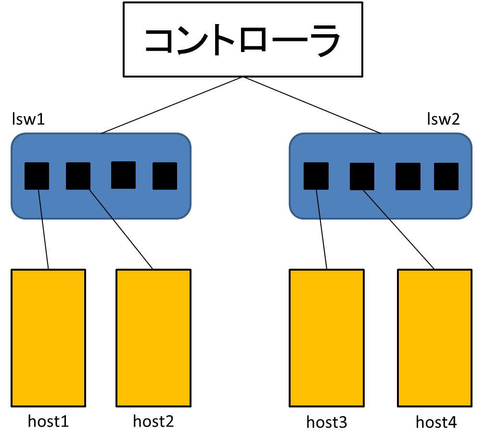

##複数スイッチ対応版 ラーニングスイッチ
複数スイッチに対応したラーニングスイッチ (multi_learning_switch.rb) の動作を説明しよう。


##解答
* start

コントローラが起動したタイミングでstartハンドラが呼ばれる。複数スイッチを管理するために、FDBを連想配列として扱っている。、

```
  def start(_argv)
    @fdbs = {}
    logger.info 'MultiLearningSwitch started.'
  end
```


* switch_ready

コントローラがスイッチに接続したときにswitch_readyハンドラが呼び出される。先ほど生成した連想配列@fdbsにスイッチのデータパスIDを用いて新たなFDBを格納している。
```
  def switch_ready(datapath_id)
    @fdbs[datapath_id] = FDB.new
  end

```
          


                                        
* packet_in

PacketInが発生するとpacket_inハンドラが呼び出される。このとき更新するFDBを特定するためにfetchを用いてデータパスIDのFDBから目的となるFDBを特定し、学習するようにしている。その後、flow_mod_and_packet_out messageによりFlowModやPacketOutを行っている。
```
  def packet_in(datapath_id, message)
    return if message.destination_mac.reserved?
    @fdbs.fetch(datapath_id).learn(message.source_mac, message.in_port)
    flow_mod_and_packet_out message
  end
```


* flow_mod_and_packet_out

@fdbs.fetch(message.dpid).lookup(message.destination_mac)によりFDBに登録されているMACアドレスを参照し、送信先のMACアドレスが登録されているかされていないかでその後分岐する。登録されているときはフローテーブルにフローエントリーを追加して、送信先のMACアドレスが接続しているポート番号に向けてPacketOutする。登録されていない場合にはfloodオプションをつけフラッディングするようにする。
```
  def flow_mod_and_packet_out(message)
    port_no = @fdbs.fetch(message.dpid).lookup(message.destination_mac)
    flow_mod(message, port_no) if port_no
    packet_out(message, port_no || :flood)
  end

  def flow_mod(message, port_no)
    send_flow_mod_add(
      message.datapath_id,
      match: ExactMatch.new(message),
      actions: SendOutPort.new(port_no)
    )
  end

  def packet_out(message, port_no)
    send_packet_out(
      message.datapath_id,
      packet_in: message,
      actions: SendOutPort.new(port_no)
    )
  end
```

##動作確認
以下のような環境で動作確認を行った

```
vswitch('lsw1') { datapath_id 0x1 }
vswitch('lsw2') { datapath_id 0x2 }


vhost('host1')
vhost('host2')
vhost('host3')
vhost('host4')

link 'lsw1', 'host1'
link 'lsw1', 'host2'
link 'lsw2', 'host3'
link 'lsw2', 'host4'
```




まず、ホスト1からホスト2に送信を行った。


```
$　./bin/trema send_packets --source host1 --dest host2
$　./bin/trema show_stats host1
Packets sent:
  192.168.0.1 -> 192.168.0.2 = 1 packet
$　./bin/trema show_stats host2
Packets received:
  192.168.0.1 -> 192.168.0.2 = 1 packet
$ ./bin/trema dump_flows lsw1
```

以上の結果より、host1(192.168.0.1)からhost2(192.168.0.2)にパケットが送信されている。


今度は逆にhost2からhost1に送信を行った。


```
$ ./bin/trema send_packets --source host2 --dest host1
$ ./bin/trema show_stats host1
Packets sent:
  192.168.0.1 -> 192.168.0.2 = 1 packet
Packets received:
  192.168.0.2 -> 192.168.0.1 = 1 packet
$ ./bin/trema show_stats host2
Packets sent:
  192.168.0.2 -> 192.168.0.1 = 1 packet
Packets received:
  192.168.0.1 -> 192.168.0.2 = 1 packet

```
さらに、host2からhost1へのパケットも送信も行われていることを確認。

もう一度host1からhost2に送信を行った。


```
$ ./bin/trema send_packets --source host1 --dest host2
$ ./bin/trema show_stats host1
Packets sent:
  192.168.0.1 -> 192.168.0.2 = 2 packets
Packets received:
  192.168.0.2 -> 192.168.0.1 = 1 packet
$ ./bin/trema show_stats host1
Packets sent:
  192.168.0.2 -> 192.168.0.1 = 1 packet
Packets received:
  192.168.0.1 -> 192.168.0.2 = 2 packets
```

となり正しくパケットの伝送が行えている。双方向にパケットを送信することで、フローエントリが更新される。


最後に、host3(192.168.0.3)とhost4(192.168.0.4)で同じことをしてから、
host1からhost3にパケット伝送を行った。

```
$ ./bin/trema send_packets --source host1 --dest host3
$ ./bin/trema show_stats host1
Packets sent:
  192.168.0.1 -> 192.168.0.2 = 2 packets
  192.168.0.1 -> 192.168.0.3 = 1 packet
Packets received:
  192.168.0.2 -> 192.168.0.1 = 1 packet
$ ./bin/trema show_stats host3
Packets sent:
  192.168.0.3 -> 192.168.0.4 = 2 packets
Packets received:
  192.168.0.4 -> 192.168.0.3 = 1 packet
```

という結果になった、これはhost1はパケットをhost3に送信したのに対し、host3にはその記録がない。このことから、
パケットが到達しなかったことがわかる。host1はlsw1にパケットを送信した後、lswはコントローラに問い合わせを行う。その後、フラッティングを行い伝送を試みるが、lsw1とlsw2が繋がっていないためパケットは棄却され、host3にパケットが到達しなかった。

